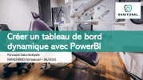

# Tableau-de-bord-PowerBI
Création d'un tableau de bord de suivi de projets internationaux pour la société SANITORAL

Réalisations : 
  + Tableau de bord  dynamique de suivi de projet
  + Documentation utilisateur pour la mise à jour du rapport

Softs Skills travaillées :
  +  Identifier les enjeux client.
  +  Collecte des users stories.
  +  Rendre la visualisation de donnée disponible et accessible.
  +  Datavisualisation claire pour engager l'utilisateur.

Compétences travaillées :
  +  Automatisation de la préparation et du nettoyage des données en PowerQuery
  +  Création de différents type de graphiques, filtres et infobulles
  +  Modélisation des données en étoile.

Outils : 
  + PowerBi, Power Query, DAXX

